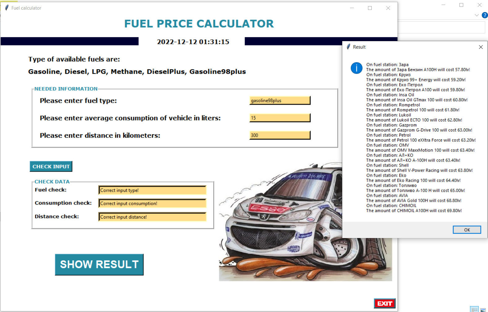
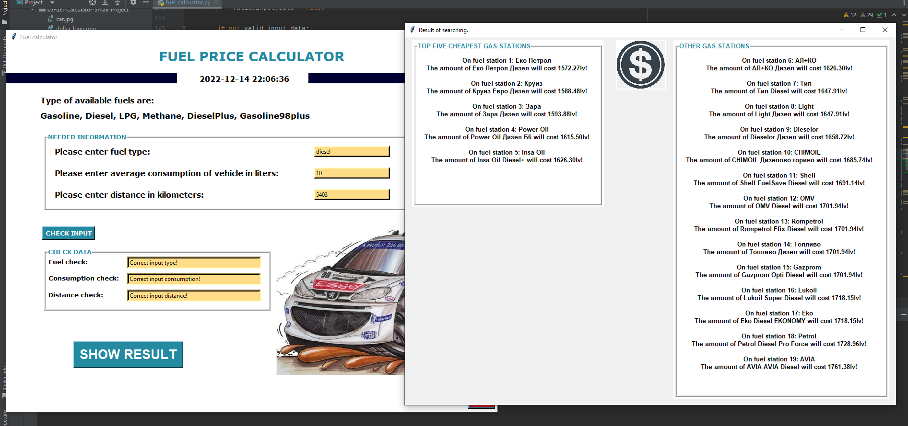

This is Fuel Amount Calculator!

Small project based on my curren knowledge of programming with Python.

[Replit Link](https://replit.com/@qceka88/Fuel-Calculator-Small-Project#main.py) to try it!

This small project is part from my education in [SoftUni](https://softuni.bg/),
[Programming Fundamentals with Python - September2022](https://softuni.bg/trainings/3840/programming-fundamentals-with-python-september-2022)

In generally this  calculator use data from web site.

For output data calculator use a user input data for Fuel Type, Average Consumtion of 
vehicle and Input Data for distance that will be traveled. Calculate fuel price for 
traveled distance based on average consumption of vehicle and output the price.

First you need to check and validate the input data. After that can export the 
the output information using integrated buttons.

Examples of this small project

Some of output data may contains cyrilic alphabeth becouse sourse is Bulgarian Web Site.

With kindly permission of  [bg.fuelot.net](https://bg.fuelo.net/)

